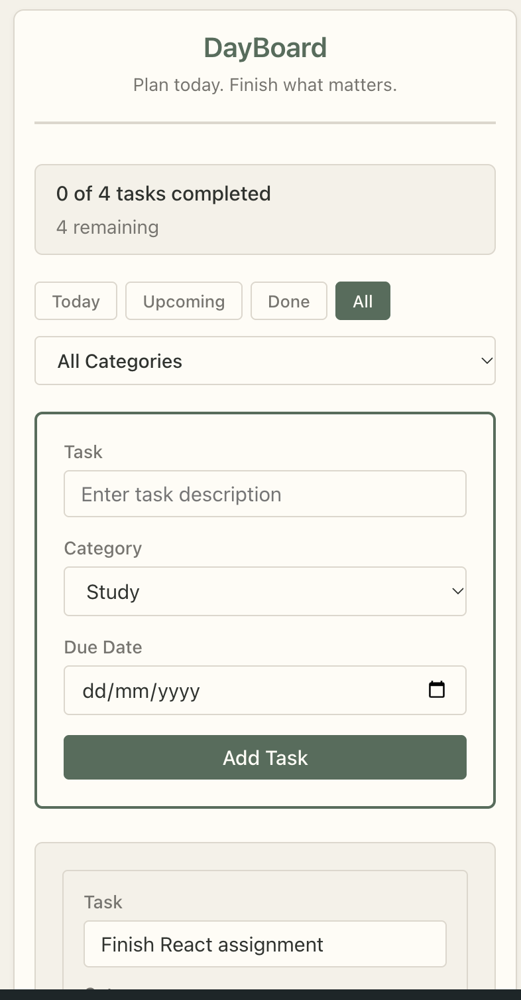
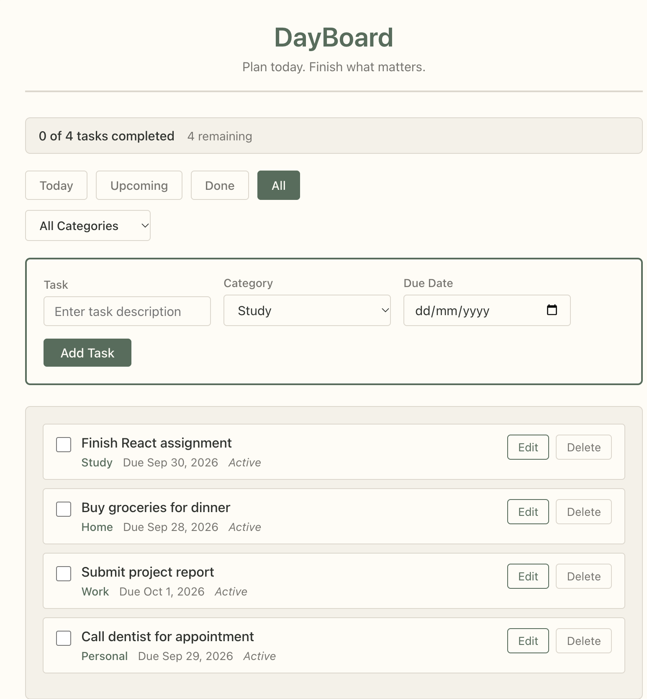
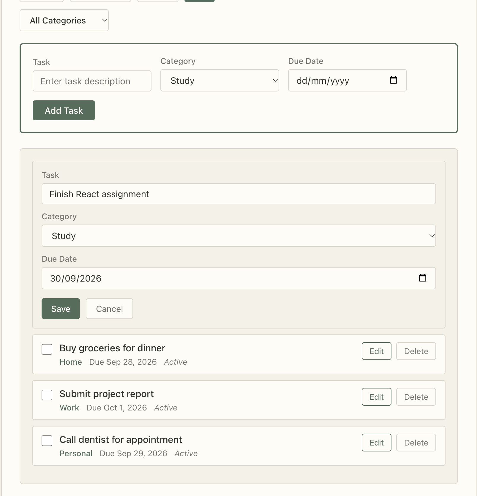

# DayBoard

## Description

DayBoard is a React-based daily planner application that helps users organize their tasks efficiently. The application allows users to add, edit, complete, and delete tasks with categories and due dates. Tasks are automatically saved to browser localStorage, ensuring data persists across sessions.

## Features

- Add tasks with text, category, and due date
- Edit tasks inline (text, category, due date)
- Delete tasks with confirmation
- Mark tasks as complete
- Mark completed tasks as active again
- Four task categories: Study, Home, Work, Personal
- Due date tracking
- Today filter (tasks due today)
- Upcoming filter (future tasks)
- Done filter (completed tasks)
- All filter (show all tasks)
- Category filter (filter by specific category)
- Combined filtering (status + category work together)
- Progress information (tasks completed and remaining)
- localStorage persistence (tasks saved automatically)
- Responsive layout (desktop, tablet, and mobile)
- Empty state messages

## Technologies Used

- React
- Create React App
- JavaScript
- CSS
- Browser localStorage

## React Concepts Used

- Functional components
- useState
- useEffect
- Props
- Callback props
- Controlled forms
- Event handling
- List rendering with .map()
- Array filtering with .filter()
- Conditional rendering
- Conditional CSS classes
- Component composition

## Project Structure

### TopBar
Displays the application title "DayBoard" and subtitle "Plan today. Finish what matters."

### QuickAdd
Handles task creation with a form containing task text input, category dropdown, and due date picker. Uses controlled inputs and validates that task text is not empty before adding.

### TaskRow
Displays and manages individual tasks. Shows checkbox, task details (text, category, due date, status), and action buttons (Edit, Delete). Switches to inline edit mode when Edit is clicked, allowing users to modify task properties.

### TaskSection
Displays the list of tasks by mapping over the tasks array. Shows empty state messages when no tasks exist or when filters return no results.

### StatusTabs
Controls task status filtering with tab buttons (Today, Upcoming, Done, All) and includes a category filter dropdown. Both filters work together to show the desired tasks.

### ProgressInfo
Displays task completion progress showing the number of completed tasks, total tasks, and remaining tasks. Values are calculated from the tasks array, not stored as state.

### App
The main component that stores task state and manages all task operations (add, edit, delete, toggle). Contains filtering logic for status and category, and handles localStorage persistence with useEffect.

## Installation

1. Clone or download the project
2. Navigate to the project directory:
   ```
   cd dayboard
   ```
3. Install dependencies:
   ```
   npm install
   ```
4. Start the development server:
   ```
   npm start
   ```

The application will open in your browser at `http://localhost:3000`

## Screenshots

### Mobile View


### Planner View


### Task Edit


## Known Limitations

- Data is stored only in the current browser using localStorage
- No user accounts or authentication
- No backend database
- No synchronization between devices or browsers
- No cloud backup of tasks
- Tasks are tied to the browser and cannot be accessed from other devices

## How to Use

1. **Add a Task**: Fill in the task description, select a category, choose a due date, and click "Add Task"
2. **Complete a Task**: Click the checkbox next to a task to mark it as complete
3. **Edit a Task**: Click the "Edit" button, modify the task details, and click "Save" (or "Cancel" to discard changes)
4. **Delete a Task**: Click the "Delete" button and confirm the deletion
5. **Filter Tasks**: Click on status tabs (Today, Upcoming, Done, All) or select a category from the dropdown
6. **View Progress**: Check the progress bar at the top to see how many tasks you've completed
